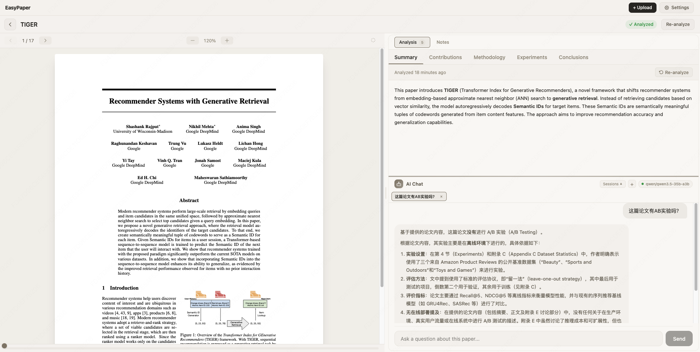

[中文文档](./README_CN.md)

# EasyPaper

[](https://www.npmjs.com/package/@lvxintao/easypaper)
[](LICENSE)
[](https://nodejs.org)

Upload academic PDFs, get AI-powered analysis, chat about the content, and take notes. Fully customizable API.




## Features

- **PDF Upload & Viewing** — Drag-and-drop upload with built-in PDF viewer (zoom, page navigation, text selection).
- **AI Analysis** — Automatically extract summary, key contributions, methodology, and conclusions via MLLM (e.g. GPT-4o), with customizable prompts.
- **Interactive Chat** — Ask follow-up questions with full paper context.
- **Notes** — Take notes on paper content with Markdown support and tag management.
- **Flexible AI Backend** — Works with any OpenAI-compatible API (OpenAI, OpenRouter, etc.).
- **Local Storage** — All data stored locally, no external database needed.

## Quick Start

### Option 1: npx (no install)

```bash
npx @lvxintao/easypaper
```

### Option 2: Global install

```bash
npm install -g @lvxintao/easypaper
easypaper
```

### Option 3: From source

```bash
git clone https://github.com/lvxintao/EasyPaper.git
cd EasyPaper
npm install
```

### Option 4: Update existing installation

```bash
npm update
npm i -g @lvxintao/easypaper@latest
```

## Usage

```bash
# npm install
easypaper # Default port 3000, optional --port <number>
-----------
# From source
cd EasyPaper
npm run start
```
Open [http://localhost:3000](http://localhost:3000) to get started.

## Configuration

Configure your AI provider in the app's **Settings** page, or via environment variables:

| Variable | Description | Default |
|----------|-------------|---------|
| `AI_BASE_URL` | API endpoint | `https://api.openai.com/v1` |
| `AI_API_KEY` | Your API key | — |
| `AI_MODEL` | Chat model | `gpt-4o` |
| `AI_VISION_MODEL` | Vision model for PDF parsing | `gpt-4o` |

- **Environment variables:** Can also be set in `~/.easypaper/.env`, with lower priority than UI settings.

## How to Use

1. **Upload** — Upload a PDF on the home page (drag-and-drop or click to browse)
2. **Open** — Enter the paper detail page with PDF viewer on the left and analysis panel on the right
3. **Analyze** — Get a structured analysis with page-referenced insights
4. **Chat** — Ask specific questions about the paper content

## CLI Options

```
easypaper [options]

  -p, --port <number>  Port to run on (default: 3000)
  -h, --help           Show help
  -v, --version        Show version
```

All data is stored locally in `~/.easypaper/`.

## Tech Stack

- [Next.js](https://nextjs.org) 16 (App Router) + React 19 + TypeScript
- [Tailwind CSS](https://tailwindcss.com) 4
- [mupdf](https://github.com/ArtifexSoftware/mupdf) for PDF rendering

## License

MIT License
