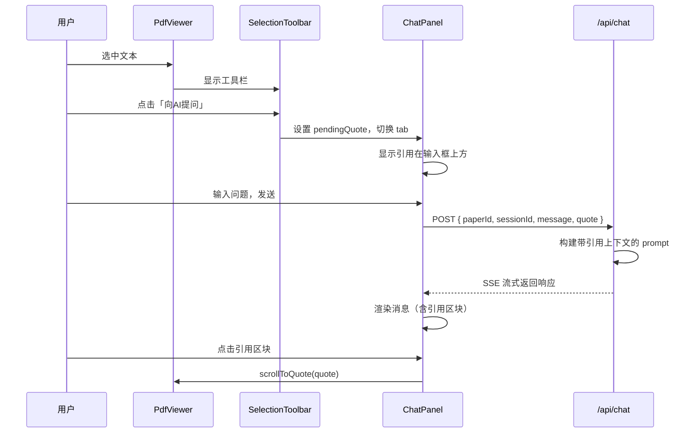

# 划句向AI提问功能设计

**日期**: 2026-03-30
**状态**: 待实现

## 概述

添加「划句向AI提问」功能，允许用户在 PDF 中选中文本后，一键将该文本作为引用上下文发送到聊天面板向 AI 提问。引用文本保留位置信息（页码、坐标），支持点击跳转到原文。

## 需求

### 用户故事

用户在阅读 PDF 时，遇到不理解的内容，希望快速向 AI 询问该内容的含义，而不需要手动复制粘贴或重新描述上下文。

### 核心需求

1. **入口**: 在 PDF 选择工具栏 (`SelectionToolbar`) 添加「向AI提问」按钮
2. **交互**: 点击后跳转到聊天面板，选中文本作为引用上下文显示在输入框上方
3. **显示**: 引用文本作为消息内的独立引用区，视觉上与用户问题区分
4. **AI上下文**: 以引用文本为主，同时可参考论文全文解析内容
5. **定位跳转**: 保存引用位置（页码+坐标），点击引用可跳转原文

## 数据结构

### 扩展 ChatMessage 类型

在现有 `ChatMessage` 类型中添加可选的 `quote` 字段：

```typescript
// src/types/index.ts

export interface ChatMessage {
  role: 'user' | 'assistant';
  content: string;
  quote?: TextSelection;  // 新增：引用文本及位置信息
}
```

复用现有的 `TextSelection` 类型（已用于 Note 的 selection 字段）：

```typescript
interface TextSelection {
  text: string;              // 引用的文本内容
  rects: HighlightRect[];    // 位置坐标（百分比）
  page: number;              // 页码（1-indexed）
}
```

### 存储变更

聊天消息存储在 `~/.easypaper/papers/{paperId}/chat-sessions.json`，现有结构：

```json
{
  "sessions": [
    {
      "id": "session-uuid",
      "title": "Session title",
      "createdAt": "...",
      "updatedAt": "...",
      "messages": [
        { "role": "user", "content": "..." },
        { "role": "assistant", "content": "..." }
      ]
    }
  ]
}
```

新增 quote 字段后：

```json
{
  "sessions": [
    {
      "messages": [
        {
          "role": "user",
          "content": "这段话具体指的是什么？",
          "quote": {
            "text": "假设空间的严格约束",
            "rects": [{ "left": 12.5, "top": 45.2, "width": 8.3, "height": 1.2 }],
            "page": 3
          }
        }
      ]
    }
  ]
}
```

向后兼容：无 quote 字段的消息正常显示。

## 组件设计

### 1. SelectionToolbar 扩展

**文件**: `src/components/selection-toolbar.tsx`

**现状**: 当前组件只有一个 `onClick` 属性用于添加笔记。

**变更**: 重命名为 `onNoteCreate`，并新增 `onAskAI` 回调。

```typescript
interface SelectionToolbarProps {
  position: { x: number; y: number };
  onNoteCreate: () => void;  // 原 onClick，重命名以语义化
  onAskAI: () => void;       // 新增：向AI提问
}
```

**视觉**: 两个按钮并列显示，「向AI提问」按钮使用 accent 色高亮。

### 2. PdfViewerRef 扩展

**文件**: `src/components/pdf-viewer.tsx`

**现状**: `PdfViewerRef` 只有 `scrollToNote(note: Note)` 方法。

**变更**: 新增 `scrollToQuote(quote: TextSelection)` 方法，用于跳转到引用位置。

```typescript
export interface PdfViewerRef {
  scrollToNote: (note: Note) => void;
  scrollToQuote: (quote: TextSelection) => void;  // 新增
}
```

**实现**: `scrollToQuote` 逻辑与 `scrollToNote` 类似，但直接接收 `TextSelection` 参数。

### 3. 聊天面板引用状态

**涉及文件**: `src/app/paper/[id]/page.tsx`（主页面）、聊天相关组件

**新增状态**: `pendingQuote: TextSelection | null`

**流程**:
- 用户点击「向AI提问」→ 设置 `pendingQuote` → 切换到聊天面板 tab
- 引用显示在输入框上方（虚线边框，带页码标记，可清除）
- 用户发送消息 → 将 `pendingQuote` 附带到消息 → 清除 `pendingQuote`

### 4. 消息内引用区块

**文件**: `src/components/chat-messages.tsx`

**现状**: 当前 Props 只有 `messages`、`streamingContent`、`isStreaming`。

**变更**: 新增 `onJumpToQuote` 回调，渲染 user 消息时若存在 `quote` 字段则显示引用区块。

```typescript
interface ChatMessagesProps {
  messages: ChatMessage[];
  streamingContent?: string;
  isStreaming?: boolean;
  onJumpToQuote?: (quote: TextSelection) => void;  // 新增
}
```

引用区块样式：
- 左侧蓝色边框（3px）
- 页码标记（可点击跳转）
- 引用文本（斜体，灰色）
- 点击整体区块 → 调用 `onJumpToQuote`

### 5. 引用区块组件（新建）

**文件**: `src/components/message-quote.tsx`

独立组件，用于在消息中渲染引用：

```typescript
interface MessageQuoteProps {
  quote: TextSelection;
  onJumpToQuote: (quote: TextSelection) => void;
}
```

## API 变更

### /api/chat

**现状**: 接收 `{ paperId, sessionId, message }`，流式返回 AI 响应。

**变更**: 接收可选的 `quote` 字段。

```typescript
// Request body
{
  paperId: string;      // 必需（现有）
  sessionId: string;    // 必需（现有）
  message: string;      // 必需（现有）
  quote?: TextSelection; // 新增：可选引用
}
```

**后端处理**:
1. 将 `quote.text` 作为重点上下文注入到 system prompt
2. 保留论文全文 `parsed.md` 作为辅助上下文
3. 返回的消息中包含 quote 字段

### System Prompt 调整

**文件**: `src/lib/prompts.ts`

**现状**: CHAT_PROMPT 使用 `{content}`、`{history}`、`{question}` 占位符。

**变更**: 新增可选的 `{quoteContext}` 占位符，当存在 quote 时注入引导文本。

```typescript
// prompts.ts 新增函数
export function buildQuoteContext(quote: TextSelection): string {
  return `用户引用了论文中的以下内容作为提问背景：
> ${quote.text}（第 ${quote.page} 页）

请优先关注这段引用内容回答问题，同时可以参考论文的其他部分提供补充说明。`;
}

// route.ts 中调用
const quoteContext = quote ? buildQuoteContext(quote) : '';
const systemPrompt = CHAT_PROMPT
  .replace('{content}', parsedContent)
  .replace('{history}', historyText)
  .replace('{quoteContext}', quoteContext);
```

### /api/paper/[id]/chat-sessions

**文件**: `src/app/api/paper/[id]/chat-sessions/route.ts`

**现状**: 处理 chat sessions 的 CRUD，消息存储不包含 quote。

**变更**: 存储逻辑无需修改，JSON.stringify 会自动包含新增的 quote 字段；读取时向后兼容（无 quote 字段正常解析）。

## 交互流程



## 文件清单

| 文件 | 操作 | 说明 |
|------|------|------|
| `src/types/index.ts` | 修改 | ChatMessage 添加 quote 字段 |
| `src/components/selection-toolbar.tsx` | 修改 | 重命名 onClick→onNoteCreate，新增 onAskAI |
| `src/components/pdf-viewer.tsx` | 修改 | PdfViewerRef 新增 scrollToQuote 方法 |
| `src/components/message-quote.tsx` | 新建 | 消息内引用区块组件 |
| `src/components/chat-messages.tsx` | 修改 | 新增 onJumpToQuote prop，渲染带 quote 的消息 |
| `src/components/chat-input.tsx` | 修改 | 支持 pendingQuote 显示 |
| `src/app/paper/[id]/page.tsx` | 修改 | 管理 pendingQuote 状态，传递回调 |
| `src/app/api/chat/route.ts` | 修改 | 接收 quote 参数，构建 prompt |
| `src/lib/prompts.ts` | 修改 | 新增 buildQuoteContext 函数 |
| `src/app/api/paper/[id]/chat-sessions/route.ts` | 无需修改 | JSON 存储自动兼容 |

## 测试要点

1. **选择工具栏**: 选中文本后两个按钮都显示，点击「向AI提问」正确跳转
2. **引用显示**: pendingQuote 正确显示在输入框上方，页码正确
3. **清除引用**: 点击清除按钮后 pendingQuote 消失
4. **发送消息**: quote 正确附带并发送
5. **消息渲染**: 引用区块样式正确，页码显示
6. **跳转功能**: 点击引用区块调用 scrollToQuote，跳转到 PDF 对应位置
7. **向后兼容**: 无 quote 的旧消息正常显示
8. **AI 响应**: 响应内容确实关注了引用文本

## 后续扩展

- 支持多段引用（一次选择多处文本）
- 引用高亮显示（跳转后在 PDF 中临时高亮引用区域）
- 引用历史面板（查看所有曾引用过的文本）